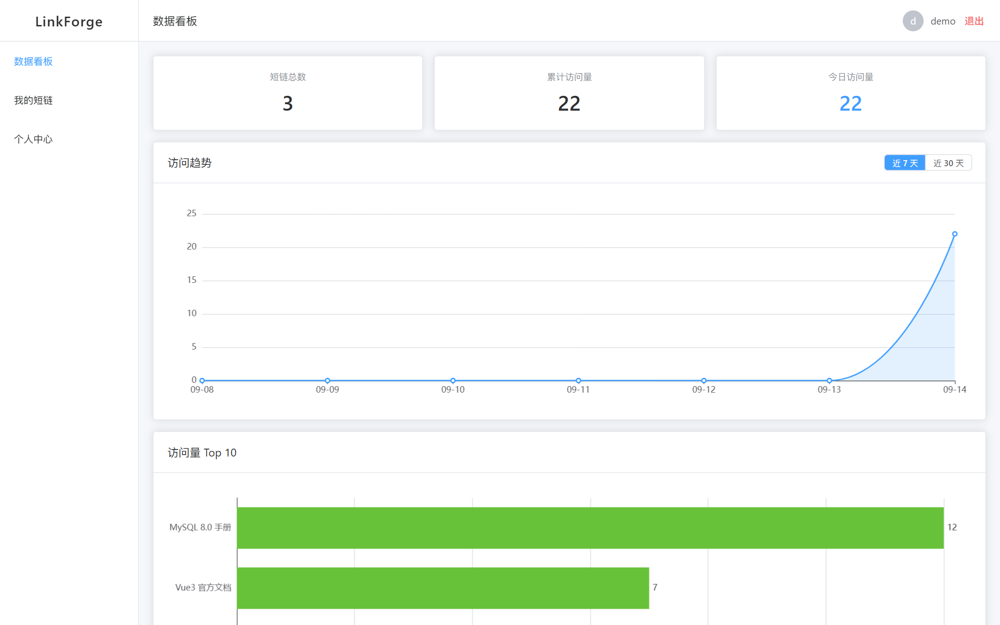
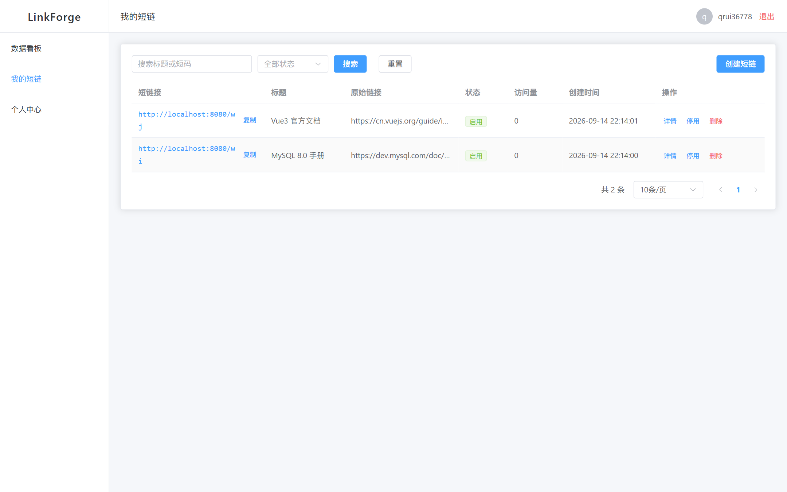
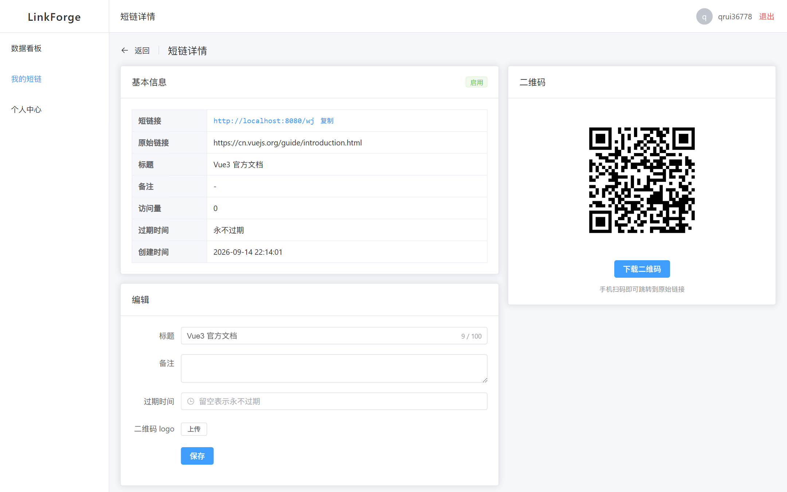
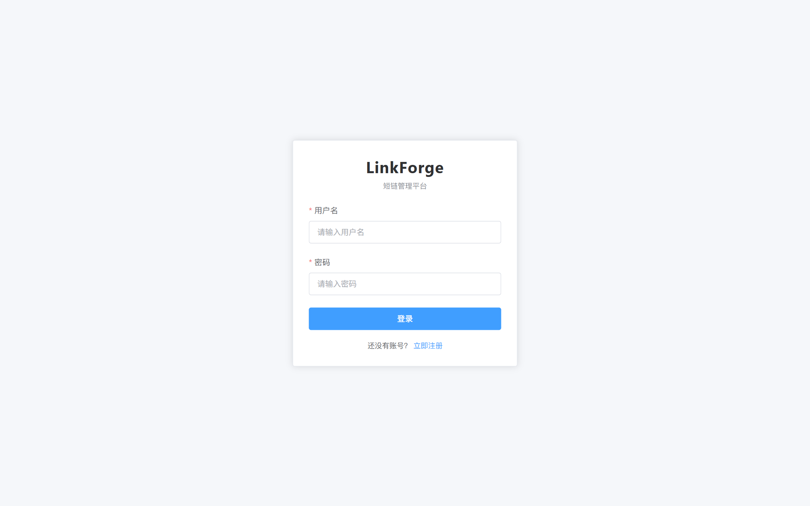
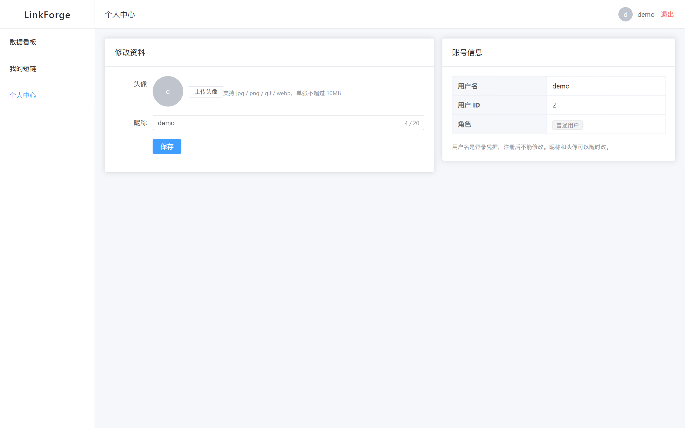
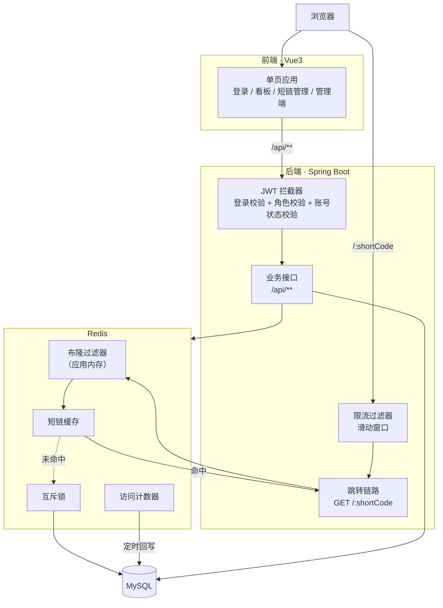

# LinkForge

短链管理平台 —— 把「一个跳转接口」做成一个完整产品。

用户注册登录后管理自己的短链、生成带 logo 的二维码、查看访问数据看板。
核心是三件事：**高并发跳转链路**、**多租户数据隔离**、**流量分析**。

---

## 功能

**用户端**

- 注册 / 登录（JWT 认证，密码 BCrypt 加密存储）
- 短链的增删改查：标题、备注、启停、过期时间、按标题或短码搜索、分页
- 二维码生成：支持上传 logo 合成到中心，多尺寸，可下载
- 数据看板：总览指标、按天访问趋势、访问量 Top N
- 个人中心：改昵称、上传头像

**管理端**

- 用户分页与启用 / 禁用
- 全部短链分页与强制删除
- 操作日志查询（谁在什么时候调了什么方法、耗时多少、有没有出错）

**跳转链路**

- 四层防护：布隆过滤器 → Redis 缓存 → 互斥锁 → 数据库
- 基于 IP 的滑动窗口限流（Redis + Lua 脚本）
- 访问计数走 Redis `INCR` + 定时批量回写，跳转链路上一次数据库都不写

---

## 界面预览

### 数据看板

总览指标、按天访问趋势（没有访问的日期也补 0，折线不会断）、访问量 Top 10。



### 短链管理

支持关键词搜索、状态筛选、一键复制、启停、删除。



<details>
<summary>更多截图（短链详情与二维码、登录页、个人中心）</summary>

**短链详情与二维码** —— 二维码可换尺寸、可下载，支持上传 logo 合成到中心。



**登录页**



**个人中心**



</details>

---

## 技术栈

| 层 | 选型 |
|---|---|
| 后端 | JDK 17 + Spring Boot 4.0.8 |
| 构建 | Maven 父子工程（5 个模块） |
| 持久层 | MyBatis-Plus 3.5.17 + MySQL 8.0 |
| 缓存 | Redis 7.4 |
| 认证 | JJWT 0.12.6 |
| 对象存储 | 阿里云 OSS V2 SDK |
| 二维码 | ZXing 3.5.3 |
| 前端 | Vue 3 + Vite + Element Plus + Pinia + Vue Router + ECharts |

---

## 架构



---

## 快速开始

### 环境要求

- JDK 17
- Maven 3.9+
- MySQL 8.0（默认端口 3306）
- Redis 7.x（默认端口 6379）
- Node.js 20+

### 1. 建库

```bash
mysql -u root -p < schema.sql
```

脚本用 `CREATE TABLE IF NOT EXISTS`，重复执行不会丢数据，也不会报错。

### 2. 配置环境变量

密码和密钥**不写进配置文件**（那些文件是要提交到仓库的），走环境变量：

| 变量 | 说明 |
|---|---|
| `DB_PASSWORD` | MySQL 密码 |
| `JWT_SECRET` | JWT 签名密钥，**长度必须 ≥ 32 字节**（HS256 不允许弱密钥） |
| `OSS_ACCESS_KEY_ID` | 阿里云 AccessKeyId |
| `OSS_ACCESS_KEY_SECRET` | 阿里云 AccessKeySecret |

生成一个够长的密钥：

```bash
openssl rand -base64 48
```

### 3. 启动后端

```bash
mvn clean install -DskipTests
mvn -pl linkforge-server spring-boot:run
```

> 不要加 `-am`。那会让 `spring-boot:run` 也作用到父工程和 common/pojo 上，
> 它们没有 main class，会直接报 `Unable to find a suitable main class`。

### 4. 启动前端

```bash
cd web
npm install
npm run dev
```

打开 http://localhost:5173

前端通过 Vite 代理把 `/api` 转发到 `localhost:8080`，所以**两个都要启动**。
首次使用需要先注册一个账号。

#### 想要管理端权限？

项目没有"注册管理员"的入口（这是有意的 —— 那种接口一旦被利用就是提权漏洞）。
本地体验时手动改一下数据库：

```sql
UPDATE t_user SET role = 1 WHERE username = '你的用户名';
```

---

## 接口文档

### 用户端 `/api/user/**`

| 方法 | 路径 | 说明 |
|---|---|---|
| POST | `/api/user/register` | 注册（无需登录） |
| POST | `/api/user/login` | 登录，返回 token（无需登录） |
| GET | `/api/user/profile` | 查当前用户信息 |
| PUT | `/api/user/profile` | 改昵称、头像 |

### 用户端 `/api/link/**`

| 方法 | 路径 | 说明 |
|---|---|---|
| POST | `/api/link` | 创建短链 |
| GET | `/api/link/page` | 我的短链分页（关键词、状态筛选） |
| GET | `/api/link/{id}` | 查单条 |
| PUT | `/api/link/{id}` | 修改（标题、备注、启停、过期时间、二维码 logo） |
| DELETE | `/api/link/{id}` | 删除（逻辑删除） |
| GET | `/api/link/{id}/qrcode` | 二维码图片（PNG） |
| GET | `/api/link/stat/overview` | 看板总览 |
| GET | `/api/link/stat/trend` | 访问趋势（按天） |
| GET | `/api/link/stat/top` | 访问量 Top N |
| POST | `/api/upload` | 上传图片到 OSS |

### 管理端 `/api/admin/**`（需管理员角色）

| 方法 | 路径 | 说明 |
|---|---|---|
| GET | `/api/admin/user/page` | 用户分页 |
| PUT | `/api/admin/user/{id}/status` | 启用 / 禁用用户 |
| GET | `/api/admin/link/page` | 全部短链分页 |
| DELETE | `/api/admin/link/{id}` | 强制删除违规短链 |
| GET | `/api/admin/log/page` | 操作日志分页 |

### 跳转（公开）

| 方法 | 路径 | 说明 |
|---|---|---|
| GET | `/{shortCode}` | 302 跳转到原始链接 |

### 统一响应格式

```json
{ "code": 0, "message": "成功", "data": { } }
```

`code` 是业务码，`0` 表示成功。**HTTP 状态码单独设置且语义化**：
未登录 401、无权限 403、参数错误 400、资源不存在 404、上传超限 413、
限流 429、服务端错误 500。

需要登录的接口在请求头里带 token（头名由 `linkforge.jwt.token-name` 配置，默认 `token`）。

---

## 测试

```bash
mvn test                  # 后端 252 个测试，约 20 秒
cd web && npm run build   # 前端构建
```

后端测试分两类：

- **单元测试**（236 个）：用手写的 mock 验证各段逻辑，不依赖 MySQL / Redis，
  随时可跑
- **集成测试**（16 个）：用 H2 内存库 + MockMvc 把整个 Spring 上下文跑起来，
  走完整 HTTP 链路（拦截器、参数校验、Service、Mapper、异常处理），
  覆盖注册登录、认证鉴权、短链 CRUD、租户隔离、二维码、看板

集成测试不依赖 Redis（用 mock 顶掉），也不需要本机装 MySQL。

## 性能

跳转接口的压测数据（本机、服务与压测工具同机）：

| 场景 | QPS | P99 |
|---|---|---|
| 有缓存 | 6464 | 35 ms |
| Redis 不可用（降级直查库） | 738 | ~300 ms |

**Redis 挂掉时失败数是 0** —— 跳转功能完全正常，只是变慢。
详细的压测方法、限流验证，以及压测抓出来的三个 bug 记录在
[docs/performance.md](docs/performance.md)。

---

## 目录结构

```
linkforge/
├── pom.xml                                 父工程，只做版本管理
├── schema.sql                              建库脚本
├── linkforge-common/                       基础设施：Result / 异常 / 常量 / 工具类
├── linkforge-pojo/                         纯数据载体：entity / dto / vo
├── linkforge-oss-spring-boot-starter/      自定义 starter（空壳）
├── linkforge-oss-spring-boot-autoconfigure/    ↑ 的自动配置实现
├── linkforge-server/                       唯一可启动模块
│   └── src/main/java/com/miuxuer/linkforge/
│       ├── controller/   admin/ 与 user/ 分包
│       ├── service/      接口 + impl
│       ├── mapper/       数据访问
│       ├── config/       各种配置类
│       ├── interceptor/  JWT 登录拦截器
│       ├── aspect/       公共字段填充、操作日志
│       ├── filter/       限流
│       ├── event/        访问事件与异步监听
│       ├── handler/      全局异常处理
│       └── task/         定时任务
└── web/                                    Vue3 前端
    └── src/
        ├── api/       接口封装（含 axios 拦截器）
        ├── router/    路由与守卫
        ├── store/     Pinia
        ├── views/     页面
        └── utils/     工具
```

---

## 关键设计

几个值得一提的取舍，详见 [docs/design.md](docs/design.md)：

- **短码用号段模式发号 + Base62 编码**，而不是 Hash 取模。id 全局唯一，短码自然唯一，
  从根本上没有碰撞问题
- **跳转链路上一次数据库都不写**。计数走 Redis `INCR`，明细走异步事件，
  两者都由后台任务/线程池消化
- **缓存 TTL 带随机抖动**（25~35 分钟）防雪崩，**互斥锁 + Double-check** 防击穿，
  **布隆过滤器**防穿透，且过滤器的缓存 TTL 会跟随短链剩余寿命
- **多租户隔离靠"查不到"而不是"事后检查"**：所有面向用户的查询强制带 `user_id`，
  接口签名里根本没有 userId 参数
- **JWT 是无状态的，所以"禁用用户"必须额外查一次账号状态**，否则被禁用的用户
  拿着旧 token 一直能用到过期
